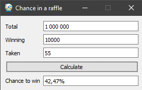

<h1><p align="center">chance-in-a-raffle</p></h1>

<p align="center"></p>


<h1><p align="center">Content</p></h1>

- [Description](#Description)
- [Useful links](#Useful-links)
- [How to run](#How-to-run)
    - [Windows](#Windows)
    - [Source code](#Source-code)
- [Updating](#Updating)
  - [Windows](#Windows-1)
  - [Source code](#Source-code-1)
- [Report a bug or suggest an idea](#Report-a-bug-or-suggest-an-idea)
- [Express your gratitude](#Express-your-gratitude)


<h1><p align="center">Description</p></h1>
<p align="right"><a href="#Content">To the content</a></p>

⠀ The program is designed to calculate the chance of winning <ins>at least one</ins> slot taken in a raffle.

<p align="center"></p>


<h1><p align="center">Useful links</p></h1>
<p align="right"><a href="#Content">To the content</a></p>

⠀[chance-in-a-raffle](https://github.com/SecorD0/chance-in-a-raffle)


<h1><p align="center">How to run</p></h1>
<p align="right"><a href="#Content">To the content</a></p>


<h2><p align="center">Windows</p></h2>

1. Download an EXE file from the [releases page](https://github.com/SecorD0/chance-in-a-raffle/releases);
2. Run the program;
3. Fill out the data:
   - `Total` — the total number of slots;
   - `Winning` — the number of winning slots:
   - `Taken` — the number of slots you have taken.
4. See the chance of winning <ins>at least one</ins> slot taken.


<h2><p align="center">Source code</p></h2>

1. Install [Python](https://www.python.org/downloads/);
2. Clone the repository:
```sh
git clone https://github.com/SecorD0/chance-in-a-raffle
```
3. Set up an environment;
4. Install requirements:
```sh
pip install -r requirements.txt
```
5. Run the `app.py`;
6. Fill out the data:
   - `Total` — the total number of slots;
   - `Winning` — the number of winning slots;
   - `Taken` — the number of slots you have taken.
7. See the chance of winning <ins>at least one</ins> slot taken.

⠀If you need convert a `.ui` file into a `.py`, use the command:
```sh
pyuic5 uis/main.ui -o windows/interface/main.py
```

⠀If you want to build the EXE file by yourself:
- Install `pyinstaller`:
```sh
pip install pyinstaller
```
- Build the EXE file:
```sh
pyinstaller app.py -wFn chance-in-a-raffle -i images/icons/app.ico --add-binary "images/icons;images/icons"
```


<h1><p align="center">Updating</p></h1>
<p align="right"><a href="#Content">To the content</a></p>


<h2><p align="center">Windows</p></h2>

1. Download an EXE file of the new version from the [releases page](https://github.com/SecorD0/chance-in-a-raffle/releases) and replace the old one with it.


<h2><p align="center">Source code</p></h2>

1. Go to the repository:
```sh
cd chance-in-a-raffle
```
2. Update the local files:
```sh
git pull
```


<h1><p align="center">Report a bug or suggest an idea</p></h1>
<p align="right"><a href="#Content">To the content</a></p>

⠀If you found a bug or have an idea, go to [the link](https://github.com/SecorD0/chance-in-a-raffle/issues/new/choose), select the template, fill it out and submit it.


<h1><p align="center">Express your gratitude</p></h1>
<p align="right"><a href="#Content">To the content</a></p>

⠀You can express your gratitude to the developer by sending fund to crypto wallets!
- Address of EVM networks (Ethereum, Polygon, BSC, etc.): `0x900649087b8D7b9f799F880427DacCF2286D8F20`
- USDT TRC-20: `TNpBdjcmR5KzMVCBJTRYMJp16gCkQHu84K`
- SOL: `DoZpXzGj5rEZVhEVzYdtwpzbXR8ifk5bajHybAmZvR4H`
- BTC: `bc1qs4a0c3fntlhzn9j297qdsh3splcju54xscjstc`

